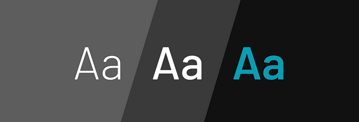

# typography

HTML Description:

: Defines a container div with the class "header."
<h2>: Represents a level 2 heading.
: Embeds an image with the class "img," a source URL, and alternative text.
: Defines a generic inline container for text content.
 : Inserts a line break.
<iframe>: Embeds an external web page (YouTube video) with specified attributes for width, height, and source.
width, height, src, title, frameborder, allow, and allowfullscreen: Attributes that control the appearance and behavior of the embedded iframe, including dimensions, source URL, title, and permissions.

CSS Description:
.header: Targets elements with the class "header."
display: flex;: Uses the Flexbox layout model for its children.
flex-direction: column;: Sets the direction of the flex container to column, making child elements stack vertically.
align-items: center;: Aligns the child elements horizontally at the center.
font-family: Cambria, Cochin, Georgia, Times, 'Times New Roman', serif;: Specifies the font family for text content.
margin-left: 10px;: Adds a 10-pixel left margin.

.img: Targets elements with the class "img."
height: 240px;: Sets the height of the element to 240 pixels.
width: 720px;: Sets the width of the element to 720 pixels.

h2: Targets <h2> elements.
font-size: 1.5em;: Sets the font size to 1.5 times the parent font size.
margin-right: 110px;: Adds a 110-pixel right margin to the element.

span: Targets  elements.
width: 440px;: Sets the width of the element to 440 pixels.
color: #00000099;: Sets the text color with alpha transparency (#00000099), making it slightly transparent.
font-size: 98%;: Sets the font size to 98% of the parent font size.
